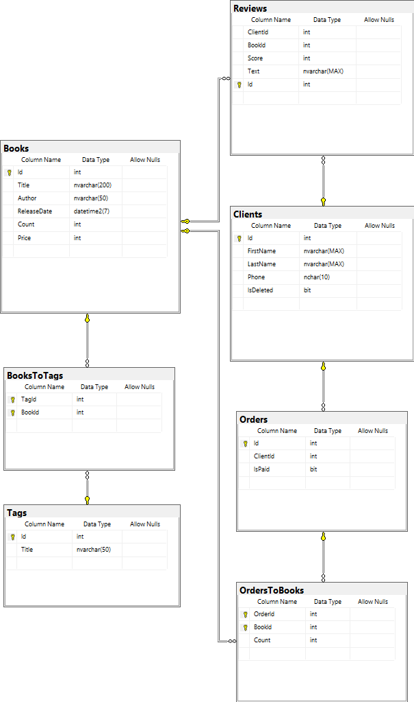

# Создание БД

1. Создали БД **bsbd_kursach**
2. Создали таблицы, представления, индекы, ограничения и триггеры
    1. tКниги
        1. Индексы: по автору, по названию
        2. Триггеры: вместо удаления помечать удаленной
    2. tЗаказы
        1. Триггеры: запрет удаления, запрет обновления
    3. tЗаказы-к-Книгам:
        1. Триггеры: запрет удаления, запрет обновления, запрет добавления к существующему заказу, проверка, что книг
           для заказа хватает
    4. tКлиенты
        1. Индексы: по телефону
        2. Ограничения: телефон 10 цифр
        3. Триггеры: вместо удаления помечать удаленным
    5. tОтзывы
    6. tТеги:
        1. Индексы: по имени
        2. Ограничения: имя уникально
    7. tКниги-к-Тегам
    8. vПользователи
3. Создали процедуры:
    1. создание пользователя
    2. удаления пользователя
    3. изменение пароля пользователя
4. Создали роль **readonly**:
    1. select таблиц и представления
    2. execute изменение пароля
5. Создали роль **worker** с правами **readonly**:
    1. u/i books
    2. u/i/d books-tags
    3. u/i tags
    4. u/i clients
    5. i orders
    6. i orders-books
    7. i reviews
6. Создали роль **admin** с правами **worker**:
    1. u/i/d books
    2. u/i/d books-tags
    3. u/i/d tags
    4. u/i/d clients
    5. i orders
    6. i orders-books
    7. u/i/d reviews
7. Создали роль **security** с правами **admin**, **securityadmin**, **accessadmin**:
    1. execute на добавления пользователя
    2. execute на удаления пользователя
8. Настроено защищенное подключение к БД (с помощью Self-Signed
   сертификата [см. скрипт](./assets/create-mssql-cert.ps1))

# Создание приложения

1. Создан клиент БД
2. Создан тестовый консольный UI
3. Создан GUI
