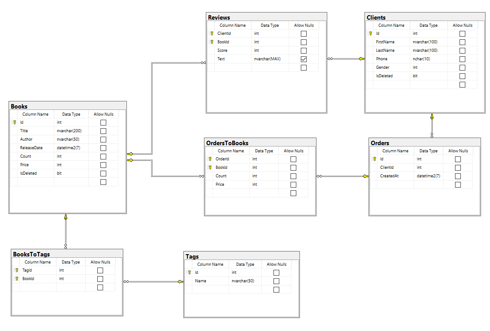

# Создание БД

1. Создали БД **bsbd_kursach**
2. Создали таблицы, индексы и ограничения
   
3. Создали УЗ главного админа **bsbd_main_admin** с правами securty, access, read, write
4. Создали роль **readonly** (select на все таблицы)
5. Создали роль **worker**:
   1. update/insert books
   2. u/i/delete books-tags
   3. u/i tags
   4. u/i clients
   5. u/i orders
   6. u/i/d orders-books
   7. i reviews
6. Создали роль **admin**:
   1. u/i/d books
   2. u/i/d books-tags
   3. u/i/d tags
   4. u/i/d clients
   5. u/i/d orders
   6. u/i/d orders-books
   7. u/i/d reviews
